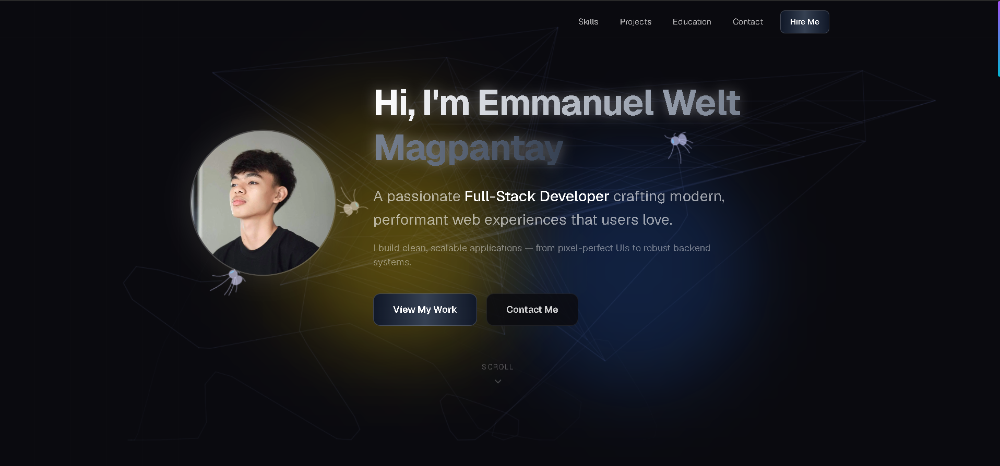
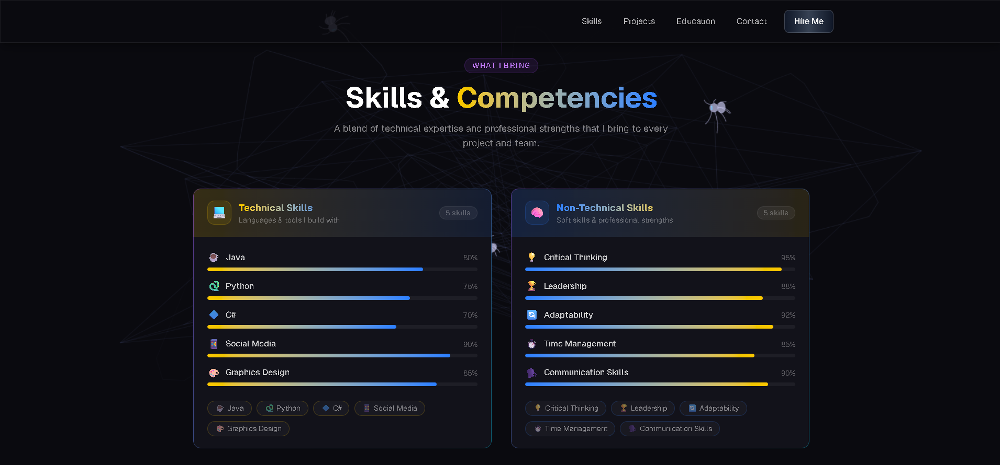
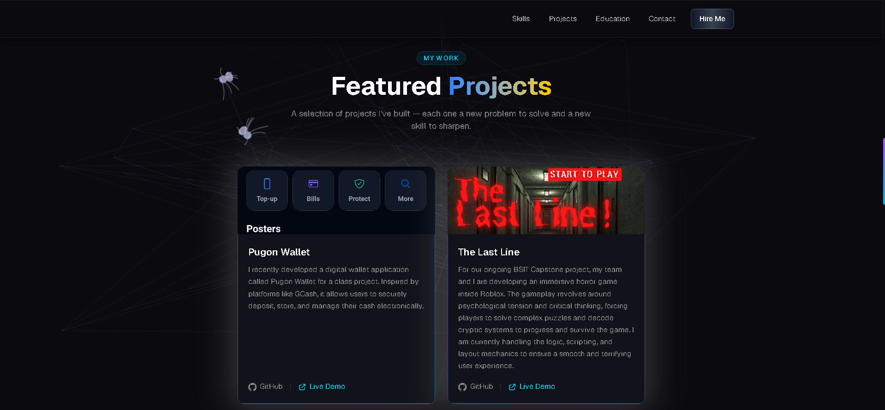

# Emmanuel's Portfolio

A personal portfolio website showcasing my projects, skills, education, and contact information.

## Description

This is a responsive developer portfolio built to highlight my work and experience. It features sections for a hero introduction, projects, skills, education background, and a contact form — all in a clean, modern layout.

## Technologies Used

- **Next.js** — React framework for server-side rendering and routing
- **React** — UI component library
- **TypeScript** — Typed JavaScript for safer, more maintainable code
- **Tailwind CSS** — Utility-first CSS framework for styling
- **ESLint** — Code linting and quality enforcement

## Screenshots

## Live Website

[emmanportfolio.vercel.app](https://emmanportfolio.vercel.app)
